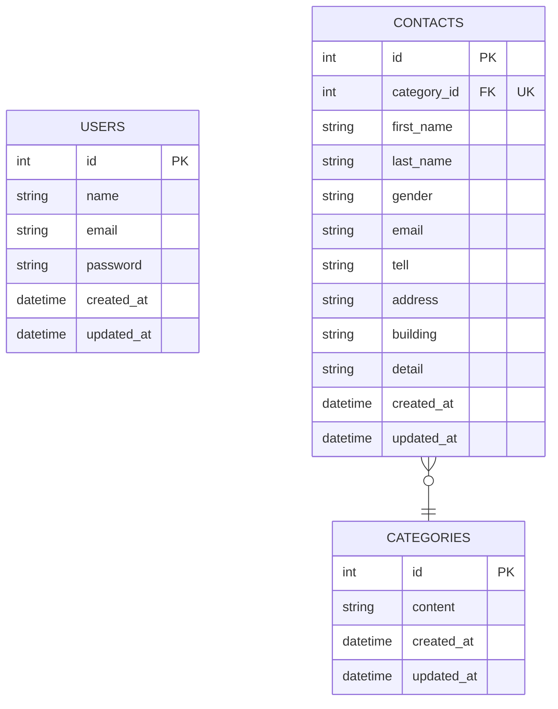

# アプリケーション名

**FashionablyLate**

## 環境構築

**Docker構築**

リポジトリをclone

```jsx
git clone git@github.com:tanakahikari-pikka/contact-form-laravel.git
```

dockerコンテナを立ち上げる

```jsx
docker-compose up -d
```

Apple Silicon（M1/M2 チップなどの ARM アーキテクチャ）を搭載した Macを使用している場合docker-compose.yamlの下記の箇所に**platform: linux/x86_64**を追記してください

```yaml
  **db:
  platform: linux/x86_64 //追記
  build: ./infra/mysql
  volumes:
    - db-store:/var/lib/mysql
  
  phpmyadmin:
    platform: linux/x86_64 //追記
    image: phpmyadmin/phpmyadmin
    environment:
      PMA_HOST: db
    ports:
      - 8081:80
    depends_on:
      - db**
```

**Laravel構築**

依存ライブラリのインストール

```jsx
cd src
docker-compose exec app composer install
```

環境変数の追加

- .envファイルをsrcディレクトリ直下に作成
- 「.env.example」の内容を.envファイルにコピー

**Application Keyの作成**

```jsx
docker-compose exec app php artisan key:generate
```

マイグレーション

```jsx
docker-compose exec app php artisan migrate
```

シード作成

```jsx
docker-compose exec app php artisan db:seed
```

## 使用技術(実行環境)

- PHP: 8.0.2
- Laravel: 9.19
- MySQL8.0.32

## ER図



## URL

開発環境：http://localhost:8080/
phpMyAdmin: http://localhost:8081/